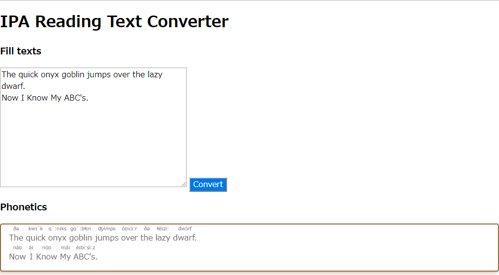

# Add \<ruby\> tags for language leaners

## Moan / 呻き
The `<ruby>` tags are troublesome, aren't these?  

---

`<ruby>` タグは面倒臭い。そうじゃない？

### Japanese / にほんご
If we want to write 『<ruby>漢字<rp>(</rp><rt>かんじ</rt><rp>)</rp></ruby>を<ruby>読む<rp>(</rp><rt>よ　</rt><rp>)</rp></ruby>。』, we have to write the following code:
```html
<ruby>漢字<rp>(</rp><rt>かんじ</rt><rp>)</rp></ruby>を<ruby>読む<rp>(</rp><rt>よ　</rt><rp>)</rp></ruby>。
```
If you want to write a long long sentence, How many tags do we need?  
And, how long does it take to do that?

---

『<ruby>漢字<rp>(</rp><rt>かんじ</rt><rp>)</rp></ruby>を<ruby>読む<rp>(</rp><rt>よ　</rt><rp>)</rp></ruby>。』と表示させたい時、次のようなコードを書かなければいけない。
```html
<ruby>漢字<rp>(</rp><rt>かんじ</rt><rp>)</rp></ruby>を<ruby>読む<rp>(</rp><rt>よ　</rt><rp>)</rp></ruby>。
```
もしも長い長い文章を書きたいとき、あなたはどれだけ多くのタグを必要とするだろうか。  
そして、そのコードはどれだけ長くなるだろうか。

#### Demo  


### English / 英語
When you want IPA, you try this. I used CMU dict.

---

IPA表記の発音記号も変換できる。発音表記はカーネギーメロン大学が配布している辞書を利用した。




## Requirements / 必須環境
- python 3.9

## Usage / 使用法
First of all, comment out the settings `config/setting.py` other than those you want to use.  
まず、使用したい設定以外の `config/setting.py` をコメントアウトします。

e.g., You chose "development" mode  
例) "development" モードを選ぶとする。
```python
# MODE = "production"
MODE = "development"
# MODE = "test"
```
This causes `app.py` to read the settings in the `config/development.yaml` file.  
Of course **you need to prepare the file with that name** in advance.  
`config/sample_setting.yaml` is prepared as a sample it.  
これにより、`app.py` は `config/development.yaml` ファイル内の設定を読み込むことになります。   
もちろん、**その名前のファイル**を事前に用意しておく必要があります。   
サンプルとして`config/sample_setting.yaml`が用意されています。  

To launch the app, enter the following command:  
アプリケーションを立ち上げるには、次のコマンドを入力します:  
```bash
$ python app.py
```

*Sometimes I notice mistakes in reading between tags*.  
Take care you use it.
何度かふりがなにミスを見つけています。  
使い方にはよく気をつけてください。

## Licence
GPL v3

## Gratitude   
[cmudict](https://github.com/cmusphinx/cmudict)  
[Prism: syntax highlight and add a copy to clipboard button](https://prismjs.com/)